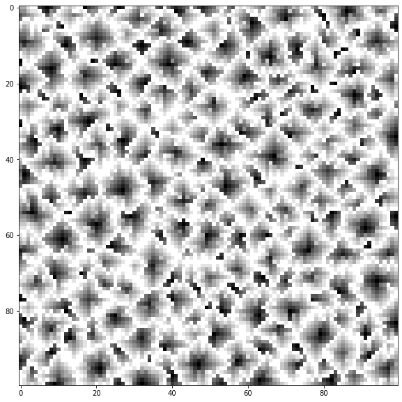
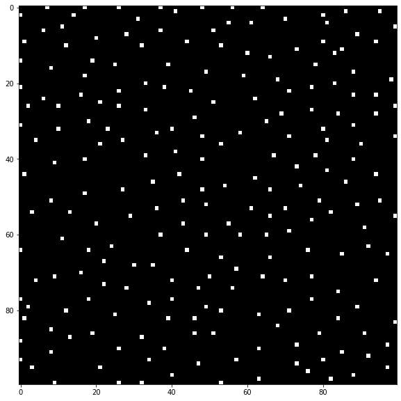
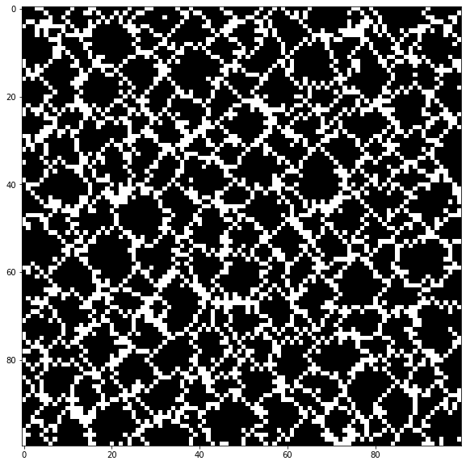
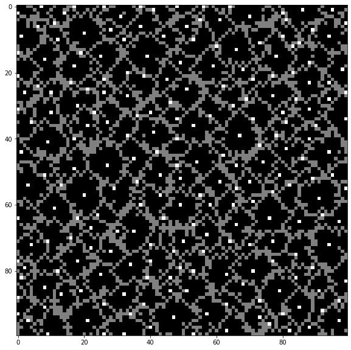
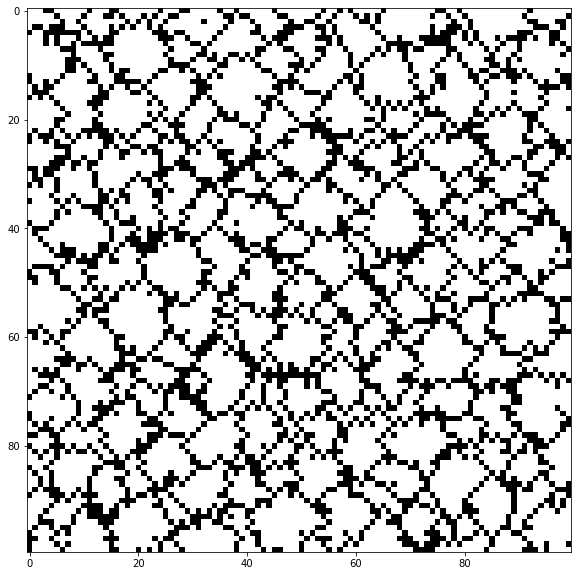
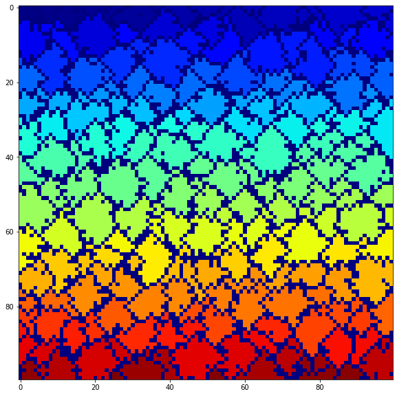

# Day 9: Smoke Basin

https://adventofcode.com/2021/day/9

## Part 1

**What is the sum of the risk levels of all low points on your heightmap?**


```python
from IPython.display import Markdown
import numpy as np
from matplotlib import pyplot as plt
from scipy import ndimage
```


```python
#infile = 'test_input.txt'
infile = 'input.txt'

lines = list()
with open(infile, 'r') as fid:
    for line in fid:
        lines.append([int(x) for x in line.strip()])
dat = np.array(lines, dtype=np.int)
#dat
```


```python
# Strategy. Go number by number. Check neighbors.
# If any neighbor is less, this is not a local min
# otherwise it is.
mask = np.zeros_like(dat, dtype=np.bool)
#mask

# Iterate over every element
for i, j in np.ndindex(dat.shape):
    minval = dat[i, j]
    # Check above
    if 0 < i and dat[i-1, j] < minval:
        # This value is not a minima
        #print("ABOVE:",minval, end=',')
        continue
    # Check below
    if dat.shape[0] - 1 > i and dat[i+1, j] < minval:
        # This value is not a minima
        #print("BELOW:",minval, end=',')
        continue
    # Check left
    if 0 < j and dat[i, j-1] < minval:
        # This value is not a minima
        #print("LEFT:",minval, end=',')
        continue
    # Check right
    if dat.shape[1] - 1 > j and dat[i, j+1] < minval:
        #print("RIGHT",minval, end=',')
        continue
    # 9 is NEVER a minima
    if dat[i, j] > 8:
        #print("GOT A 9 at {}, {}".format(i, j))
        continue
    # If we're still here, minval IS a minima
    mask[i, j] = True
    #print("...", dat[i, j], minval)
#display(dat[:20,:20])
#display(mask.astype(np.int)[:20,:20])
```


```python
risks = dat[mask] + 1
#risks
risksum = risks.sum()
#Markdown("Sum of the risk levels is: **{}**".format(risksum))
```

## Part Two

**What do you get if you multiply together the sizes of the three largest basins?**


```python
# Find basin by taking each low point and finding
# how many points there are bounded by 9's
```


```python
# Lets make some plot's to improve understanding
fig, ax = plt.subplots(figsize=(10, 10))
ax.imshow(dat, cmap='gray')
```


    <matplotlib.image.AxesImage at 0x1e8e8afac88>


    

    


```python
fig, ax = plt.subplots(figsize=(10, 10))
ax.imshow(mask, cmap='gray')
```


    <matplotlib.image.AxesImage at 0x1e8e8de64e0>


    

    


```python
dat9 = dat == 9
fig, ax = plt.subplots(figsize=(10, 10))
ax.imshow(dat9, cmap='gray')
```


    <matplotlib.image.AxesImage at 0x1e8e8e42518>


    

    


```python
mask9 = mask*2 + dat9
fig, ax = plt.subplots(figsize=(10, 10))
ax.imshow(mask9, cmap='gray')
```


    <matplotlib.image.AxesImage at 0x1e8e91b99e8>


    

    


```python
# Every boundary with 9's defines a basin with a minima inside
# Create a map where all 9's are zeros and all non-9's are 1's
dat2 = dat != 9
fig, ax = plt.subplots(figsize=(10, 10))
ax.imshow(dat2, cmap='gray')
```


    <matplotlib.image.AxesImage at 0x1e8e9227da0>


    

    


```python
# Now label all the features that are non zero to get all basins
labels, nfeatures = ndimage.label(dat2)
```


```python
# nfeatures notably contains the number of minima from part 1
assert(mask.sum() == nfeatures)
```


```python
fig, ax = plt.subplots(figsize=(10, 10))
ax.imshow(labels, cmap='jet')
```


    <matplotlib.image.AxesImage at 0x1e8e9284f98>


    

    


```python
# Now just count the labels using a histogram to get the
# basin sizes
count, bins = np.histogram(labels, bins=np.arange(nfeatures+2))
```


```python
itop = np.argpartition(count, -4)
# Exclude count of zeros in top 3 basins
top3 = count[itop[-4:]]
top3 = top3[top3 != count.max()]
```


```python
basinmx = top3[0] * top3[1] * top3[2]
#Markdown("The product of the 3 largest basin sizes is: **{}**".format(basinmx))
```


```python

```
